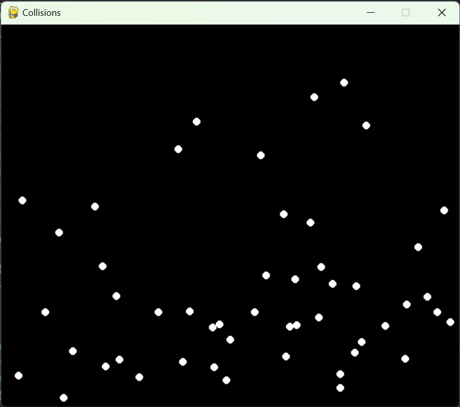

# collision2d: The Particle Simulator

This project simulates the behavior of particles within a defined environment using a simple physics engine in a 2D enviroment.



### Description

The simulation consists of particles moving within a two-dimensional space, bouncing off the walls and each other with specified characteristics such as mass, velocity, and elasticity. The simulation aims to demonstrate basic principles of physics and particle dynamics.

### Components

- **Game Module**: The `game.py` module provides the visualization of the particle simulation. It uses the Pygame library to create a window where particles are displayed and updated in real-time.

- **Engine Module**: The `engine.py` module contains the physics engine responsible for simulating the behavior of particles. It calculates particle interactions, collisions with walls, and updates particle positions and velocities accordingly.

### Parameters

- `SCREEN_WIDTH` and `SCREEN_HEIGHT`: Dimensions of the simulation window in pixels.

- `BG_COLOR`: Background color of the simulation window.

- `PARTICLE_COLOR`: Color of the particles displayed in the simulation.

- `FPS`: Frames per second at which the simulation runs.

- `NUM_PARTICLES`: Number of particles in the simulation.

- `DIAG_ONE` and `DIAG_TWO`: Coordinates of the diagonal corners of the simulation space.

- `ELASTICITY`: Coefficient of restitution representing the elasticity of collisions.

- `ACCLN`: Acceleration vector affecting the particles (e.g., gravity).

- `PARTICLE_MASS`: Mass of each particle.

- `PARTICLE_RADIUS`: Radius of each particle.

- `PARTICLE_MAX_VEL`: Tuple representing the maximum and minimum velocity components of the particles.

- `T_COSNST`: Time constant used in the simulation.

### Usage

To run the simulation, execute the `main()` function in the `__main__.py` file. This will initialize the physics engine with the specified parameters and start the visualization in a Pygame window.

```bash
python __main__.py
```

### Dependencies

- Pygame: Required for visualization of the simulation.
- Numpy: Required for vector calculations
